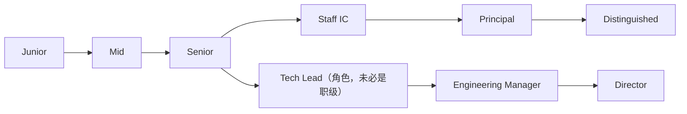

# 软件工程师之路 · 升级打怪路径

> 用它定位自己在哪条能力带、看清差距、知道下一步练什么。所有级别定义都用公开的公司职级框架和资深工程负责人的原话校准过，来源见 §7。
> 读法：先读 §0 的主命题（全文的尺子），再用 §1 找位置、§2 看升级动力，最后用 §6 自测与规划。姊妹篇《产品经理之路》与本篇同构，可对照阅读。

---

## 0. 总论：成长不是学更多技术栈，而是扩大可负责的问题空间

先定一个主命题，后面每一级都是它在变深：

> 软件工程师的成长，本质是能在更大的影响范围内，稳定解决更模糊、更高复杂度的问题，并用工程判断和组织杠杆放大产出。级别只是这件事的刻度。

它能反驳两个最常见的误解：

1. **成长 = 会更多技术栈**：错。公开职级框架几乎一致地把 scope（问题规模）和 impact（影响范围）放在定级核心，而不是技术栈数量。Dropbox 的原话是 “Each level in this framework is defined by scope, collaborative reach, and levers for impact.” Square 说得更硬：晋级时其他维度可以不全满足，但 “they must meet the Scope & Impact criteria”。
2. **成长 = 写更多代码**：也错。Will Larson 概括高级工程师的关键转变是 “their team's impact grows as their coding blocks shrink”，影响力变大的同时，亲自写代码的时间反而在缩小（但不是不写代码，见暗线 C）。

贯穿全文的坐标是**影响力半径**：你解决的问题影响到谁？从只影响自己，到一个模块、一个系统、多个团队、整个公司。Monzo 干脆把这条半径写成每一级的标签：Task → Project → Large/complex projects → widespread impact across an area → Collective → Company。这是这条路的主刻度：

最后预告一个岔路：走到 Senior 之后，路分成 IC（技术专家）和 Manager（管理）两条轨。转管理不是升职（Square：“Becoming an EM is not a promotion—it's a different role”）。详见 §4，本文主脉走 IC。

### 本模型的适用边界（先校准，再使用）

这是一个应然模型，用前先知道它的边界，别全盘照搬：

1. 采样偏差：定级口径取自 Dropbox / Square / GitLab / Monzo 等欧美 IC 文化成熟的公司，不直接等同国内 P/T 序列的现实——后者里 KPI、headcount、向上管理、时机的权重往往更高。
2. 应然 ≠ 实然：本文讲的是成长“应该”怎样（实力 → 信任 → 升级）；真实晋级也掺杂熬资历、项目卡位、运气。把它当镜子和尺子，别当晋升保证。
3. 管理轨口径有文化局限：“转管理不是升职”是 Square 的特定语境；国内管理轨常常就是更高薪、更高位，请按本地现实理解 §4。
4. 深技术方向是例外：编译器、ML 系统、安全、数据库内核等方向，Principal 拼的就是技术纵深，“杠杆 > 写代码”对它们要打折——看 §3 Staff 的 Architect / Solver 原型，而非主脉叙事。

---

## 1. 全景地图：五级能力带 + 双轨分叉

先说清五级的性质：Junior → Mid → Senior → Staff → Principal 是一条能力带，不是通用头衔。各公司命名和排序并不统一（Staff / Senior Staff / Principal / Distinguished 顺序各异），所以正文用“能力带”，标题保留最常见的叫法。Monzo 提醒这套框架 “is a compass, not a GPS”，不能拿来逐条打勾：他们上一版按行为清单定级，结果让工程师 “checkboxing their progression”，于是推翻重做。看下表时请看 scope 和 impact 的实质，别当打勾清单。

| 能力带 | 影响力半径（Monzo 口径） | 一句话定位 | 升级标志：信任边界扩大 |
|---|---|---|---|
| Junior（IC2/L3 区间） | Task | 可靠完成边界清楚的任务 | 别人信任你独立完成一个清楚的任务 |
| Mid（IC3/L4 区间） | Project / feature | 独立负责一个模块/功能 | 别人信任你负责一个模块 |
| Senior（IC4/L5 区间） | 团队级的大型/复杂/模糊项目 | 负责复杂项目与系统质量 | 别人信任你负责系统与关键决策 |
| Staff（IC5/L6 区间） | 跨团队、ill-defined 的开放问题 | 跨团队解决重要技术问题 | 组织信任你解决跨团队复杂问题 |
| Principal（IC6/L7+ 区间） | 组织/公司级，多年期 | 设定公司级技术方向 | 公司信任你设定长期技术方向 |

两个必须说清的现实：

- Senior 在很多公司是 terminal level（终点站），不是所有人都该默认冲 Staff。Gergely Orosz 的观察是：Senior 是“团队内自主”的天花板，大多数工程师在这里停留很久，且完全是体面的终点。到 Staff 的难度，显著高于到 Senior。
- Staff 和 Principal 的区别不止“影响力更大”：Staff 解决的是跨团队的复杂/模糊问题；Principal 负责的是公司级技术方向、长期约束、业务-技术判断（Dropbox IC6：“a holistic view of the engineering org… optimized for the wider org, rather than my local project alone”）。

双轨在 Senior 之后展开，上轨是技术专家轨，下轨是管理轨，Tech Lead 是角色而非职级（见 §4）：

---

## 2. 贯穿全程的 4 条暗线

级别是明线，下面是推动升级的内在动力。真正决定你能不能升级的，是这几条线推进了多少。其中第一条就是已经立过的主线，这里只点名；真正“暗”的是后三条，且已刻意去重，把影响力、产出形态、杠杆拆成互不重叠的三件事。

### 暗线 A：影响力半径（主线，前面已立）

个人 → 一个模块 → 一个系统 → 多个团队 → 整个组织/公司（已在 §0 可视化）。每升一级，本质是你能为之负责的影响力半径扩大一圈。Dropbox / Square / Monzo / GitLab 全用它定级。

### 暗线 B：复杂度 / 模糊度——问题清不清楚

明确的任务 → 方案待定的问题 → 约束不稳定的开放问题 → ill-defined、没人知道怎么解的问题。

这是高级工程师真正的分水岭。Larson 对 Staff 问题的定义是 “an ambiguous, important problem that the company's systems are ill-shaped to address”。Monzo 把 Senior 定义为 “projects of ambiguous scope and/or high complexity”，Staff 是 “own ill-defined, highly ambiguous projects”。Allspaw 一句话点透判断力的本质：“All engineering decisions exist within a spectrum; we do not live in a binary world.” 越往上，越是在没有标准答案的灰度里做权衡。

### 暗线 C：工程产出形态——你交付的东西在变

代码 → 测试 → 设计文档 → 技术方案/选型 → 事故复盘 → 技术战略。

这条线最容易被误读成“越高级越不写代码”。其实 Staff+ 不是停止编码，而是编码之外的设计、判断、协调、系统性产出变得同等关键。Larson 的准确说法是 “coding blocks shrink”（写代码的时间块缩小），不是归零。

### 暗线 D：杠杆——从“自己做完”到“让别人更容易做”

自己完成 → 让别人更容易完成（平台 / 规范 / 架构 / 评审 / 培养 / 对齐）。

这是 Staff+ 的本质：影响力靠杠杆放大，而不是靠自己产能。但这里有个陷阱必须正面讲。

关于胶水工作（glue work）：Tanya Reilly 指出，高级工程师做大量非编码的协调/补位/推动共识工作（“noticing when other people are blocked and helping them out… reviewing design documents and noticing what's being handwaved”），这些是项目成败的关键。但如果你在成为 senior 之前过早、过量地做胶水工作，很可能 career limiting：performance review 很漂亮，晋升却被拒，理由是“没产出多少代码、影响力不够”。她的警告原话是 “If you only do glue, you will only get better at glue.”

正确姿势是让杠杆/胶水工作绑定可晋升的技术影响：争取被认可的技术领导头衔、留下记录影响力的产出物；如果晋升仍卡住，就暂时停掉胶水工作、去拿可量化的技术成就。杠杆是放大器，不是用来替代技术判断的。

### 一张总览：每升一级，4 条线各推进到哪

| 能力带 | A 影响力半径 | B 复杂度/模糊度 | C 产出形态 | D 杠杆 |
|---|---|---|---|---|
| Junior | 个人 / 任务 | 明确的任务 | 代码 + 测试 | 自己做完 |
| Mid | 一个模块 | 方案待定 | + 模块设计 | 自己做完 |
| Senior | 一个系统 / 团队 | 模糊项目 | + 设计文档 / 事故复盘 | 开始放大他人 |
| Staff | 多个团队 | ill-defined 开放问题 | + 技术方案 / 选型 | 平台 / 规范 / 架构 |
| Principal | 组织 / 公司 | 公司级长期问题 | + 技术战略 | 设定方向、影响组织 |

---

## 3. 逐级详解

> 每一级看四样：**定位、失败形态（要打的怪）、信任边界、晋级分界**。本级技术底盘见 §5，可观察证据见 §6 工具一。自查时重点看“失败形态”——你是不是正困在这里。

### Junior（影响力半径：Task）

定位：可靠完成边界清楚的任务。Monzo：“Delivers well-defined tasks, with support from more experienced engineers.” 核心工作是在指导下实现明确需求，学会团队的工具链和协作方式。

能力项：技术上是语言基础、Git、调试、写测试、读懂代码库；协作上能清楚表达要点、接受 code review；影响力是把交给你的任务做完做对、不留坑。

失败形态（要打的怪）：学了一堆框架，却交付不了一个干净的功能。只追新名词、不练基本功。陈皓 2011 年那篇练级攻略的核心忠告至今有效：“不要乱追新技术新名词，基础的东西经过很长时间积累而且还会在未来至少 10 年通用。”

晋级 → Mid：别人开始信任你独立完成清楚的任务，可以把一个完整的小模块交给你。

### Mid（影响力半径：Project / feature）

定位：独立负责一个模块或功能。Monzo：“Owning, implementing and delivering medium sized features or projects within a team.” 核心工作是独立拆解需求 → 设计 → 实现 → 上线，处理线上问题，和产品/测试/上下游协作。

能力项：技术上是模块边界、接口设计、数据建模、写可维护的代码；协作上理解业务上下文、参与设计讨论、把控 PR 粒度；影响力是为一个模块的质量负责。

失败形态：代码能跑，但在制造维护成本。功能实现了，却没有模块边界、不理解业务上下文，留下一堆以后要还的债。

晋级 → Senior：别人信任你负责一个模块，并且你开始能啃“方案还不清楚”的问题，而不只是“怎么做都告诉你了”的任务。

### Senior（影响力半径：团队级的大型/复杂/模糊项目）

> Senior 是这条路上最关键的一级，也是很多公司的 terminal level。这里的跃迁不是“更熟练”，而是从执行明确任务转向负责模糊问题和系统质量。

定位：负责复杂项目与系统质量，影响力开始溢出自己的项目、影响到团队。Monzo：“consistently delivering on projects of ambiguous scope and/or high complexity”；GitLab：“technical problems of high scope and complexity… particular impact across your team”。核心工作是系统设计、技术选型、风险识别，为可靠性/性能/质量负责，指导新人，推动项目落地。

能力项：技术上是系统设计、可靠性、性能、技术取舍、事故复盘；协作上指导他人、把设计局限在项目早期就讲清楚（而非事后甩锅）；影响力是影响整个团队的技术质量。

失败形态：

- 把 senior 理解成“会更多框架 / 熬够年限”。Allspaw 反复强调 “I expect a 'senior' engineer to be a mature engineer”：senior 指的是成熟度、判断力、责任感、系统视角，不是技术掌握量。他有几条很硬的判据：主动寻求对自己方案的批评、把权衡显式讲出来（“make trade-offs explicit”）、不做“掩盖屁股工程”（cover-your-ass engineering）、“Understanding what is and isn't 'premature' is what separates senior engineers from junior engineers”。
- 只做局部最优：只优化自己手里那块，看不到系统全局。

晋级 → Staff：别人信任你负责系统与关键决策，而且你的影响力开始想要跨出单个团队的边界。注意：到这里停下来当一个长期资深的 Senior，是完全体面的选择。

### Staff（影响力半径：跨团队）

定位：跨团队解决重要的、ill-defined 的技术问题。GitLab：“Staff and above positions are more of a role than just a 'level'”，是整体职责角色的转变，不是技术栈的再积累。

Larson 总结了 Staff 的四种典型形态（archetype），不必全占，找到适合你的那种：

- Tech Lead：领导一个团队的技术方向与执行（最常见，常是第一个 Staff 角色）
- Architect：为某个关键技术域（API/基础设施/存储）负责方向与质量
- Solver：被组织信任去深挖最棘手的复杂问题，解决后转移阵地
- Right Hand：延伸某位高管的注意力，借用其 scope 和权威（最稀有，千人规模才出现）

能力项：技术上是跨系统架构、平台化、演进策略、技术债治理；协作上用洞察力而非层级权力领导一群团队（Larson：“leading constellations of teams despite limited tailwinds from bestowed organizational authority”）；影响力是对多个团队负责，且 “accountable to the business and organization first and yourself second”。

失败形态：

- 只想自己写、不愿做胶水工作，或走向另一极端只协调、不产出技术判断。Staff 要在“放大他人”和“亲自做出关键技术判断”之间保持平衡（回看暗线 C/D）。
- 把“亲自实现最难的项目”当成价值来源。Larson 说 Staff 应 “default to delegating such projects across the team”。

晋级 → Principal：组织信任你解决跨团队复杂问题，且你的判断开始影响到组织级、多年期的技术方向。

### Principal（影响力半径：组织 / 公司级）

定位：设定公司级技术方向。Dropbox IC6：“I own and deliver org/company-wide, multi-year, multi-team goals… a multi-year, industry-leading perspective.” 核心工作是公司级架构判断、长期技术战略、技术债的根治、业务与技术的经济学权衡、定义“哪些问题最值得解决”。

能力项：技术上是公司级技术战略、架构原则、长期约束、业务-技术经济学；协作上为整个工程组织优化而非自己的局部项目；影响力是 Monzo Distinguished 的口径——“Impact is lasting… leaves a legacy”。

失败形态：只追技术先进性，不承担业务后果。沉迷于“最酷的架构”，却脱离了它要服务的业务价值和长期成本。

再往上：横向的管理轨（Director/VP）是另一个问题空间，见 §4。

---

## 4. 分叉专题：IC vs Manager——不是谁高，是换问题空间

走到 Senior 之后，IC（技术专家）和 Manager（管理）分成两条平行轨。这一节要破三个误解。

误解一：转管理 = 升职。错。Square 的原话最直接：“Engineers and Engineering Managers can exist at the same Square Level with different job criteria. Becoming an EM is not a promotion—it's a different role.” 在 Square，L5 这一级同时挂着两张完整的标准表，一张给 “a strong independent contributor”，一张给 “a new manager”，scope & impact 定义完全不同，级别数字却一样。Dropbox、GitLab、Monzo 都把两轨列为独立的 job family。

误解二：Tech Lead 是一个职级。错。Camille Fournier 的定义：Tech Lead is “not a point on the ladder, but a set of responsibilities”，是角色，不是级别。一个 Senior 可以是 Tech Lead，仍然写代码，同时承担项目拆解、向上汇报、赋能团队，要在 maker's schedule（深度编码）和 manager's schedule（协调沟通）之间反复切换。

误解三：优秀程序员自然能当好管理者。大错。Fournier 点了两个坑：

- Alpha Geek 问题：那些把智力和技术能力凌驾于一切之上的人，往往会成为糟糕的管理者，因为他们贬低同事、拙于沟通。技术光环不会自动转化为领导力。
- 能力结构是根本性转变：“People skills are what the new tech lead is asked to stretch, much more than pure technical expertise.” 优秀工程师赖以成功的“深度专注”，恰恰和管理角色要求的东西相悖。
- 还有一条判据值得记住：“If your teams can't operate well without you, you'll find it hard to be promoted.” 管理的成功标志是团队能离开你独立运转，而不是更依赖你。

怎么选？Fournier 的态度很务实：“You can switch tracks if you want. It is common for people to try out management… realize they don't enjoy it, and go back to the technical track.” 转管理是一次问题空间的更换（从“把技术问题解决好”换成“把团队和人经营好”），不是技术能力的线性放大。这一点和姊妹篇《产品经理之路》里“产品经理 → CEO 是问题空间跃迁”完全同构。

---

## 5. 技术内功底座：每一级的工程底盘

> 五级能力带讲的是影响力的广度；工程师还需要一条正交的硬技术纵深。技术内功不是“先学这个再学那个”的路线图，而是每一级必须配套的底盘，所以下面按职业阶段给，而不是按语言/OS/网络/数据库/算法主题铺开。

| 能力带 | 本级技术底盘 | 可对照的权威实践来源 |
|---|---|---|
| Junior | 代码可读性、测试、调试、Code Review、基础数据结构 | Google Eng Practices（Naming/Comments/Style/Complexity 四个审查维度）；阿里 p3c（命名/格式/单元测试规约） |
| Mid | 模块边界、接口设计、数据建模、可维护性 | 阿里 p3c（工程结构/应用分层/依赖管理）；Google Eng Practices（小粒度 CL、CL 描述） |
| Senior | 系统设计、可靠性、性能、技术取舍、事故复盘 | 陈皓练级攻略“高级深入”段；美团技术（复杂业务系统的可靠性/性能案例）；Google Eng Practices（Design 维度） |
| Staff | 跨系统架构、平台化、演进策略、技术债治理 | 美团技术（平台化/大规模重构案例） |
| Principal | 公司级技术战略、架构原则、长期约束、业务技术经济学 | — |

方向性补充（不放进通用底盘，避免误导）：

- CNCF Cloud Native Trail Map（容器 → CI/CD → K8s 编排 → 可观测性 → 服务网格 → 网络/策略 → 分布式数据库 → 消息流 → 存储）：只适用于云原生 / 后端基础设施方向。前两步（容器化、CI/CD）几乎是任何后端工程师的基础操作面；后段（服务网格、分布式存储）属于 Staff+ 的平台/基础设施方向，不是通用工程师底盘。
- 陈皓《程序员练级攻略》：一份很好的技术内功纵深阅读清单（语言/OS/网络/DB/算法/分布式/工程实践），但写于 2011 年，技术选型（SVN/LAMP/Hadoop 等）已过时，取其方法论（基础优先、动手实践、批判思维），别照搬技术选型；作者另有 2018 付费更新版。
- 阿里 p3c：Java 专属规范（强制/推荐/参考三档 + 正反例），中文 Java 团队的工程规范佐证；其“分档 + 正反例”的设计思路可跨语言借鉴。

---

## 6. 个人定位与规划工具

### 工具一：我现在在哪条能力带？（自测，也是每一级的可观察证据）

按 scope/impact 的实质勾选（不是数技能点），最后一个能全勾的就是你当前的位置：

- [ ] Junior：能按规范独立交付一个清楚的小任务，代码过 review、有测试、不留明显的坑。
- [ ] Mid：能独立负责一个模块/功能从设计到上线的完整生命周期（Square L5 IC：“Independently responsible for the entire lifecycle of projects or features”），懂业务上下文，别人接手你的代码不痛苦。
- [ ] Senior：能负责复杂/模糊的项目和系统质量，独立产出设计文档、推动评审、做事故复盘；面对没有标准答案的灰度问题能讲清取舍。
- [ ] Staff：能定义并推动一个跨团队的技术方向，在没有直接管辖权时靠技术影响力让多团队对齐。
- [ ] Principal：你设定的技术方向被整个组织采纳并长期生效，能改变公司在关键技术问题上的下注。

### 工具二：差距诊断——回到 4 条暗线

定位后逐条问自己，这才是升级的真正阻力点：

1. 影响力半径：我现在能为之负责的半径是个人、模块、系统、跨团队，还是组织？
2. 复杂度/模糊度：我处理的是“怎么做都告诉我了”的任务，还是“没人知道怎么解”的开放问题？
3. 工程产出形态：我交付的还只是代码，还是已经能产出设计文档、技术方案、事故复盘？
4. 杠杆：我还停在“自己做完”，还是已经能“让别人更容易做完”？我的胶水工作有没有绑定可被看见的技术影响？

哪条线最落后，下一步就主攻哪条。

### 工具三：下一步学习任务（按当前能力带）

| 当前能力带 | 练什么 | 三个动作 |
|---|---|---|
| Junior / Mid | 可靠交付 + 可维护 | ① 用 Google Eng Practices 八维度自审最近一个 PR；② 重画一个旧模块的边界/接口，问“别人接手痛不痛苦”；③ 把一个大 PR 拆成小粒度 CL 并各写清描述 |
| Senior | 模糊问题 + 系统质量 | ① 写一份开头就列权衡/局限的设计文档（Allspaw 的 “make trade-offs explicit”）；② 复盘一次事故、产出可执行改进项而非甩锅；③ 把一个决策放进 spectrum 里讲清为何非非黑即白 |
| Staff+ | 跨团队影响力 + 杠杆 | ① 从 Larson 四原型选一个最像你的补短板；② 做一件“让多团队更容易做事”的杠杆工作并确保被记录、被认可；③ 自检胶水工作有没有绑定可晋升的技术成果，若没有按 Reilly 的建议调整 |

### 工具四：自检 / 面试别人的硬问题

1. 你最近解决的最模糊的一个问题是什么？模糊在哪？你怎么把它变清楚的？
2. 举一个你显式讲清权衡的设计决策——你当时放弃了什么、为什么？
3. 你负责过的最大影响力半径是什么？个人、模块、系统，还是跨团队？
4. 你做过哪件“让别人更容易做事”的杠杆工作？它被记录/认可了吗？
5. （针对想转管理的人）你怎么理解 “becoming a manager is not a promotion, it's a different role”？
6. 你有没有因为系统全局，放弃过一个你自己很想做的局部最优方案？

### 工具五：把晋级嵌入复盘——以季度 thesis 为脊柱

先过一道闸：你该不该为下一级做优化？Senior 在很多公司是体面的终点站（见 §1）。把晋级当默认目标，容易反向逼出橱窗工程。更稳的脊柱是“扩大我能负责的真实影响”，晋级是它的滞后副产品。确认要做，再往下跑。

晋级的真实杠杆，从高到低：

1. 你签下的项目 scope——级别在你挑活那一刻就大致定了，不在事后复盘里。
2. Manager 共识——晋级决定通过他/校准做出，他不认同、没看到证据就没用。
3. 证据沉淀——必要，但只是记账，是最低杠杆的一环。

把能量放在前两层，别押在周复盘上。三层节奏：

| 节奏 | 动作 | 角色 |
|---|---|---|
| 季度 | 写一句**晋级 thesis**：我正刻意高出当前级别运行的那一个模糊项目是什么。与 manager 共同签字，约定够格的证据清单。 | 发动机（向前） |
| 月 | 对照工具一的证据勾一遍 + 只深问工具二里最落后的一条暗线；thesis 跑偏就校准。 | 方向盘 |
| 周 | 事件触发、不强制：本周真有值得记的事才往台账丢一行，标上影响力半径。再加一个陷阱探测问题——“我这周是不是主要在做胶水/局部最优？” | 捕捉 + 预警 |

为什么这样最稳：周维度只做廉价捕捉与预警，强制每周写满既不准也坚持不下来，能长期跑的系统才是好系统；真正的发动机是季度 thesis 与 manager 共担——它们对着第 1、2 个杠杆使劲，而不是最低杠杆的记账。

> 验证一个级别是否达到，靠三条腿对齐：**证据（产出物）+ 信任边界（别人无监督授权你做什么）+ 他评（manager/校准）**。单靠自评打勾最不可靠，这也是 Monzo 推翻 checkbox 式定级的原因（见 §1）。

---

## 7. 来源方法论与引用说明

本文不按来源罗列，而按“一个自洽成长模型”组织；来源用于校准，分三层：

| 层级 | 作用 | 来源 |
|---|---|---|
| 一级（定义职级与影响范围） | 给出 scope/impact 的定级口径 | [Dropbox Career Framework](https://dropbox.github.io/dbx-career-framework/)、[Square/Block Career Ladder](https://developer.squareup.com/blog/squares-growth-framework-for-engineers-and-engineering-managers/)、[GitLab Engineering Job Families](https://handbook.gitlab.com/job-families/engineering/backend-engineer/)、[Monzo Progression Framework v4.1](https://monzo.com/documents/engineering-progression-framework-v4-1.pdf) |
| 二级（解释高级工程师的行为模式） | 给出成熟度/模糊问题/胶水工作/双轨的洞察 | Will Larson [StaffEng](https://staffeng.com/) / [staff-engineer-archetypes](https://lethain.com/staff-engineer-archetypes/)、John Allspaw [On Being A Senior Engineer](https://www.kitchensoap.com/2012/10/25/on-being-a-senior-engineer/)、Tanya Reilly [Being Glue](https://www.noidea.dog/glue)、Camille Fournier《The Manager's Path》(O'Reilly, 2017)、Gergely Orosz《The Software Engineer's Guidebook》 |
| 三级（技术实践与学习底盘） | 给出每一级的工程底盘佐证 | [Google Eng Practices](https://google.github.io/eng-practices/)、[阿里 p3c](https://github.com/alibaba/p3c)、[美团技术](https://tech.meituan.com/)、[CNCF Trail Map](https://github.com/cncf/trailmap)、[陈皓 程序员练级攻略](https://coolshell.cn/articles/4990.html) |

引用说明 / 免责：本文参考 Dropbox、Square、GitLab、Monzo 的公开职级框架，以及 Will Larson、John Allspaw、Tanya Reilly、Camille Fournier、Gergely Orosz、陈皓等公开资料，结合个人理解整理而成。所有框架结构均用自己的话重述、不搬运原结构图、不全文翻译；英文短句为原文引用并已标注出处。

几处时效性提醒：

1. 陈皓练级攻略写于 2011 年，方法论有效、技术选型已过时；
2. Gergely 的职业路径原博客已失效、内容迁至付费 newsletter，稳定引用请指向其书《The Software Engineer's Guidebook》；
3. Monzo 以 PDF v4.1（2025-09）为准，GitHub 旧版已非 source of truth；
4. Fournier《The Manager's Path》无公开全文，相关引用经多个二手摘要交叉核实。

---

> 一句话总线：软件工程师这条路，明面上是 Junior→Mid→Senior→Staff→Principal 五级，内核是同一件事在持续变深——在更大的影响范围内，稳定解决更模糊、更高复杂度的问题，并用工程判断和组织杠杆放大产出。打怪升级，打的从来不是技术栈数量，而是你能为多大、多模糊的问题负责。
